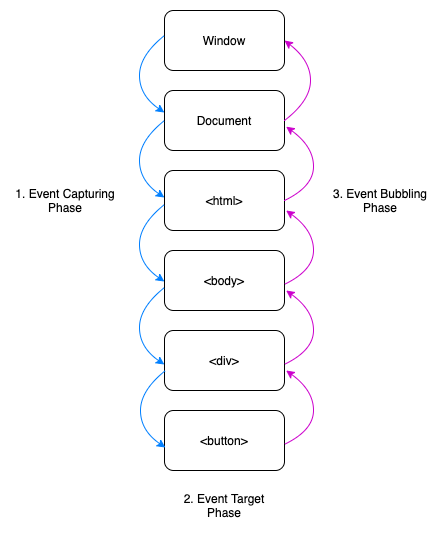

## Events
- Events are things that happen in the system you are programming — the system produces (or "fires") a signal of some kind when an event occurs, and provides a mechanism by which an action can be automatically taken (that is, some code running) when the event occurs. Events are fired inside the browser window, and tend to be attached to a specific item that resides in it. 
- This might be a single element, a set of elements, the HTML document loaded in the current tab, or the entire browser window. There are many different types of events that can occur.

For example:

- The user selects, clicks, or hovers the cursor over a certain element.
- The user chooses a key on the keyboard.
- The user resizes or closes the browser window.
- A web page finishes loading.
- A form is submitted.
- A video is played, paused, or ends.
- An error occurs.

### Event delegation
- `Event delegation` is a design pattern in which a single event listener is attached to a common ancestor (ie parent element), rather than attaching listeners to multiple individual elements.
-  It is an event-handling pattern that allows you to handle events at a higher level in the DOM tree other than the level where the event was first received.
- This pattern takes advantage of `event propagation`, specifically the "bubbling" phase, where an event travels up the DOM hierarchy from the target element to the root.
- `Capturing` and `bubbling` allow us to implement one of the most powerful event handling patterns called event delegation.
- Event delegation is possible because of event propagation in the DOM, where the event a child element receives is also passed to the child's parent and ancestors
  
#### Benefits of Event Delegation
- Event Delegation is a useful pattern that allows you to write cleaner code, and create fewer event listeners with similar logic.
- `Efficiency`: Imagine you have a list of items, each requiring a click event. Instead of attaching a click handler to each item, event delegation allows you to attach a single listener to the parent container. This results in less code and better performance, especially for large sets of elements.
- `Dynamism`: Event delegation is particularly useful when dealing with dynamic content. As new elements are added or removed, the event listener remains attached to the parent, reducing the need for constant reattachment.

## Event propagation
- Event propagation in JavaScript is a mechanism that dictates how events travel through the Document Object Model (DOM) when an event occurs, eventually reaching the target element and possibly executing further actions based on the event. 
- It’s essential for managing how events are handled in a structured manner, especially in complex web applications with nested elements, each potentially having its own event handlers.
-  There are two ways to handle this event propagation order of HTML DOM is Event Bubbling and Event Capturing.
-  Calling Event.stopPropagation() will prevent further propagation through the DOM tree, and only run the event handler from which it was called.
- Event delegation is a technique used to handle events efficiently by attaching a single event handler to a parent element, while event propagation refers to the mechanism by which events travel through the DOM tree, either from the root to the target (capturing phase) or from the target to the root (bubbling phase).
  

## Phases of Event Propagation
- `Capturing (or Capture) Phase`: This is the first phase in the event propagation process. When an event is triggered, it first travels from the root of the DOM tree down towards the target element. During this phase, event listeners can be executed if they are set to capture mode​​.
- `Target Phase`: This is the phase where the event reaches the target element on which the event was triggered. Any event handlers attached to the target element are executed during this phase​​.
- `Bubbling Phase`: In this phase, the event bubbles up from the target element back to the root of the DOM tree, executing any event listeners in its path, provided they are set to bubble mode​​.

### Event Bubbling
- Event Bubbling is a default behavior for events.
- When an event happens on a component, it first runs the event handler on it, then on its parent component, then all the way up on other ancestors’ components. By default, all event handles through this order from center component event to outermost component event.

### Event Capture
- t is the opposite of bubbling. The event handler is first on its parent component and then on the component where it was actually wanted to fire that event handler. In short, it means that the event is first captured by the outermost element and propagated to the inner elements. It is also called trickle down.